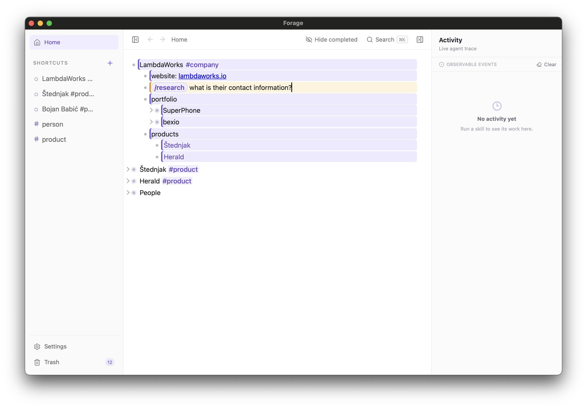

# Forage
Forage is a second brain note taker with customizable agents. Powered by [Pi](https://pi.dev).


## Features

- **One outline, real nesting** — the entire document is a single TipTap editor. Undo/redo is native and works across any edit, including agent output.
- **Keyboard-first navigation** — Tab/Shift-Tab to indent, Enter for siblings, Alt-Arrow to move branches, plus zoom/hoist into any bullet, drag-reorder, and search.
- **Slash-command skills** — start a bullet with `/` to invoke a skill:
  - `/research <topic>` — investigate a topic and structure findings as child notes
  - `/brainstorm <prompt>` — generate ideas and options for the current note
  - `/ask <question>` — ask the agent about the current branch
  - `/image <prompt>` — generate an image under the current bullet (via Codex or the OpenAI Images API)
- **Bi-directional links** — type `[[` to link any bullet to any other via stable IDs: click to jump, and a backlinks panel shows everything that references the current bullet. Links survive reordering and nesting, and linked branches can be pinned as explicit agent context.
- **Your notes as agent memory** — every skill invocation automatically carries the bullet's full ancestry and branch, and agents can search your whole outline (`search_outline`) before writing, so answers build on what you already know instead of duplicating it.
- **Extensible agents and skills** — every agent and slash-command skill is a typed definition you can edit in Settings (Cmd+,): model, instructions, and a per-agent tool allowlist. Add your own custom HTTP tools, new skills, or whole new agents.
- **Tags, shortcuts, and trash** — tag bullets, pin frequently used branches to the sidebar, and recover deleted branches from trash.

## Requirements

- Node.js 18+
- Rust toolchain (Tauri build) — install via [rustup](https://rustup.rs/) if missing
- [Codex CLI](https://github.com/openai/codex) 0.148.0+ on `PATH` — **only needed for subscription-mode image generation** (`/image`). API-key image generation and all other features work without it.

## Run it

```bash
npm install          # installs webview + agent sidecar dependencies
npm run tauri dev    # launches the real desktop app
```


## Built on Pi

Agent execution runs on [Pi](https://pi.dev): Forage embeds the Pi SDK in an isolated Node.js sidecar and talks to it over JSONL. Agents, skills, and tools ride on Pi's agent loop rather than a black-box prompt wrapper — bounded, inspectable, and swappable.

## Architecture, briefly

- **Editor:** one TipTap document; bullets are ProseMirror `listItem`s, agent output is marked and styled separately, images are dedicated nodes.
- **Identity:** each bullet gets a stable UUID via a ProseMirror plugin, so links and references survive reordering.
- **Persistence:** the whole tree is written as a single JSON file (debounced, flushed on quit).
- **Agent:** work runs in an isolated Node.js sidecar embedding the Pi SDK, communicating over JSONL. Tools are bounded (`web_search`, `web_fetch`, `generate_image`, `emit_outline`, plus validated custom HTTP tools). Context sent to the agent is capped by a fixed safety budget.
