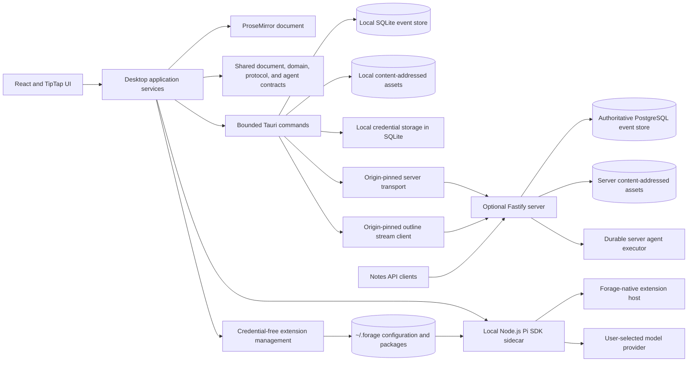

# Forage Architecture

This document describes the current implemented architecture. ADRs retain the history and rationale behind individual decisions; this page is the canonical map of the system as it exists now.

## System map

## Authority and ownership

Forage has one ProseMirror document for the entire outline. While the desktop is running, that document is the authoritative editing model; stable identities live inside its nodes. The durable event stream reconstructs the document and its associated trash and shortcut projections without introducing relational rows as a second authoritative outline model.

Responsibilities are divided by capability:

| Boundary | Owns |
| --- | --- |
| React/TypeScript desktop | Editor behavior, application orchestration, event capture, deterministic projection, synchronization policy, agent context and tool policy, and UI state |
| Shared TypeScript packages | ProseMirror schema and operations, event envelopes and reduction, protocol validation, rebase behavior, agent configuration, run inputs, activity, and structured-result contracts |
| Tauri/Rust boundary | SQLite durability, checkpoints and outbox state, local content-addressed asset bytes, local credential storage, and origin-pinned authenticated server transport |
| Local Node.js sidecar | In-memory Pi SDK sessions, local model/tool execution, the private native-extension adapter, streaming lifecycle events, structured output, cancellation, and process cleanup |
| Forage extension host | Manifest-only inventory, device-local configuration/package lifecycle, trust and revision checks, native tool/hook loading, and bounded extension execution outside the webview |
| Optional server | Authentication, global event sequencing, authoritative server-mode projection, Notes API, asset transfer, agent configuration, and durable agent work |
| PostgreSQL | Authoritative server-mode events, revisions, projections, credentials, automation policy, durable agent queues, leases, activity, and result identity |

## Storage modes

### Local mode

Local mode requires no account or server. SQLite in the platform application-data directory is authoritative for immutable events, checkpoints, persistent history, local agent-run state, and synchronization metadata. Asset bytes live beside it in a verified content-addressed store. Local mode is intentionally single-device and does not use iCloud for document synchronization.

### Server mode

In server mode, PostgreSQL is authoritative and assigns the global event revision. The desktop's SQLite database remains a durable offline cache and pending outbox:

1. Local edits are appended to SQLite before they are considered durable.
2. The synchronization engine pulls authoritative remote events and pushes pending local events through the native authenticated transport.
3. Safe ProseMirror changes are rebased; unsafe transformations enter an explicit conflict state rather than overwriting either side silently.
4. Accepted server events and acknowledgements are recorded locally, preserving readable offline state.
5. Referenced assets are signature- and hash-verified independently and transferred through the corresponding content-addressed stores.

Remote changes arrive over a WebSocket rather than by frequent polling. The connection lives in Rust because it carries the server credential and the pinned origin; the frontend receives validated frames as Tauri events. A frame whose range begins exactly at the local cursor is applied through the same validate, project, and persist path as a pull. Anything else - a gap, an unacknowledged local edit, a reconnection - falls back to a normal synchronization, so a dropped frame costs a pull rather than correctness. Whether the stream is currently delivering is published as a single piece of client state, and everything that would otherwise poll reads it: while the stream is live, outline synchronization and agent run observation ask the server nothing and wait only on a slow backstop that catches a socket which died without saying so; while it is down, refused, or absent from an older server, they fall back to intervals short enough to serve as the observation themselves. A reconnection wakes every in-flight run observer at once, because no frame reports what was missed while the socket was gone.

Fan-out runs through PostgreSQL `LISTEN`/`NOTIFY`. The agent worker is a separate process, so a notification inside the API process would never observe work the worker commits. Database triggers publish the outline identifier and revision only; subscribers read the events themselves.

A freshly bootstrapped server holds an owner and credentials but no outline. The first desktop to enrol claims the server and seeds it with that device's own replayed document state, so the operator's existing local notes become the server's content; later devices pull that outline and leave their own local outlines parked. Outlines are never merged (ADR-0015).

The initial server is self-hosted and single-owner. Multiple devices and scoped API clients are supported; teams, shared editing, real-time cursors, and a managed Forage cloud are not part of the current architecture.

Server-mode authority is explicit:

| Concern | Authority | Derived/local state |
| --- | --- | --- |
| Outline content | `outline_projections.state` at `outlines.current_revision` | Desktop replay cache and pending outbox |
| Search | Canonical outline for validation | Rebuildable `note_projections` index |
| Agent behavior | Portable configuration revision | Confirmed desktop mirror |
| Model and credential | Environment-local compute profile | Sanitized metadata only |
| Run execution | Immutable server admission snapshot | Remembered desktop run ID and activity cursor |

The flattened note index never authorizes or validates a write. Its source revision and projector schema are tracked independently, and startup deterministically repairs missing, stale, or incomplete rows from the canonical outline.

## Agent execution

The desktop supports two execution locations behind shared run and result contracts:

- Local execution launches the Node.js sidecar, which embeds the Pi SDK and uses a user-owned OpenAI API key or short-lived ChatGPT OAuth credential. The sidecar is stateless across invocations and receives only explicitly selected outline context and authorized tools.
- Server execution accepts a small invocation intent and resolves current canonical context, portable configuration, compute, credentials, and capabilities at admission. PostgreSQL-backed workers claim bounded leases and append sanitized activity. The application-level desktop run manager observes multiple runs across popup closure, restart, disconnect, and reconnect.

Both paths return validated structured outline nodes. Server output is persisted before placement and enters the outline as one atomic `agent.result_committed` event. A missing or trashed target produces `completed_unplaced`; the intact stored output can later be placed exactly once under another live node. There is no parallel agent-owned outline, and the editor remains available while runs and synchronization continue.

### Local extensions

Local extensions use Forage's single current `forage.extension.json` and `@forage/extension-api` contract, not Pi's extension or package APIs. Settings inventory is manifest-only until a user explicitly reviews, trusts, and enables a source. Installation, activation, app-rendered configuration, global tool enablement, and explicit executor selection are distinct gates. The API supports bounded tools, `run:start`/`run:end` hooks, and generic skill executors; feature-specific semantics belong to extensions, and the API exposes no React, Tauri, editor, server, or Pi objects.

Extension-backed skills remain the same user-created slash skills as LLM-backed skills. An extension declares only an execution choice and bounded form; it never installs a command, skill, or executable webview. Forage supplies an immutable, bounded context snapshot and owns reference admission, process lifecycle, durable result retention, and atomic ordinary-outline placement. The extension owns its feature semantics and returns static text/reference nodes. System One follows this boundary in full—including candidate policy, Choice/Score/Noul semantics, Jev transport, filtering, ordering, and formatting—so core has no System One execution type or provider abstraction. Removing an extension leaves its saved ordinary output readable and its skill definition retained as unavailable.

The credential-free management sidecar owns `~/.forage/settings.json`, drop-ins under `~/.forage/extensions/`, and immutable managed revisions under `~/.forage/packages/`. npm and Git are invoked only for explicit preview/install/update checks or updates, with dependency lifecycle scripts disabled. Normal startup, refresh, validation, and invocation use installed local state only.

At local admission, the desktop captures a catalog/configuration/source digest snapshot and explicit tool ownership. The run sidecar verifies it before import, leases managed revisions for the run, and applies the same effective allowlist to built-in, custom HTTP, and extension tools. Pi remains a replaceable internal agent-loop adapter behind this native boundary. Enabled extensions are trusted Node.js code with the user's process permissions; the host and process separation are not an OS sandbox. Extension installations, settings, secrets, and snapshots remain device-local, and server execution never falls back to them.

See [Extensions](extensions.md) for the Settings and development workflow.

## External capture and assets

The server Notes API accepts bounded plain-text capture commands and deterministically creates semantic `note.created` events under a stable parent, normally Inbox. Optional policies may admit server agent work for webpage, X, or YouTube enrichment without delaying or invalidating the original capture.

Generated raster images are stored outside the event payload as content-addressed bytes. Events and ProseMirror nodes carry verified SHA-256 references, keeping synchronization and replay independent from large binary payloads.

## Governing decisions

- [ADR-0002: Use One ProseMirror Document for the Outline](ADRs/ADR-0002-single-prosemirror-outline.md)
- [ADR-0003: Embed Stable Bullet Identity in Document Nodes](ADRs/ADR-0003-embed-bullet-identity.md)
- [ADR-0006: Generate Agent Output from Explicit Branch-Local Context](ADRs/ADR-0006-branch-local-agent-generation.md)
- [ADR-0007: Expose Only Bounded Declarative Model Tools](ADRs/ADR-0007-bounded-declarative-model-tools.md)
- [ADR-0009: Keep Codex CLI for Subscription Image Generation](ADRs/ADR-0009-keep-codex-cli-for-subscription-images.md)
- [ADR-0011: Retain Tauri and TipTap](ADRs/ADR-0011-retain-tauri-tiptap-over-gpuix.md)
- [ADR-0012: Use an Event Store with an Optional Self-Hosted Server](ADRs/ADR-0012-event-store-and-optional-server.md)
- [ADR-0013: Embed the Pi SDK in a Local Node.js Sidecar](ADRs/ADR-0013-embedded-pi-sdk-sidecar.md)
- [ADR-0016: Use the Canonical Outline for Correctness-Critical Server Operations](ADRs/ADR-0016-canonical-outline-over-note-index.md)
- [ADR-0017: Provision and Mirror Server Agent Configuration](ADRs/ADR-0017-provision-and-mirror-server-agent-configuration.md)
- [ADR-0018: Resolve Models and Credentials Through Environment Compute Profiles](ADRs/ADR-0018-environment-compute-profiles.md)
- [ADR-0019: Admit Server Agents From Invocation Intents](ADRs/ADR-0019-intent-based-server-agent-admission.md)
- [ADR-0020: Keep Agent Runs Concurrent and Commit Results Atomically](ADRs/ADR-0020-concurrent-agents-and-atomic-results.md)
- [ADR-0021: Allow Explicitly Trusted Local Code Through a Forage Extension Contract](ADRs/ADR-0021-trusted-local-forage-extensions.md)

For server setup, security, and operational limits, see [Optional Server Backend](server-backend.md).
