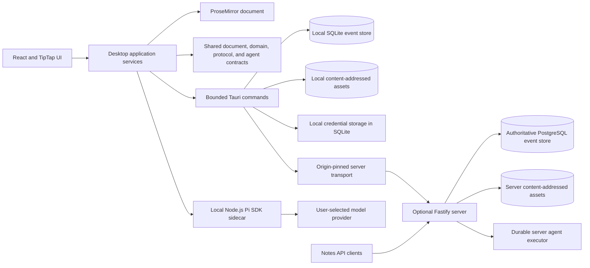

# Forage Architecture

This document describes the current implemented architecture. ADRs retain the history and rationale behind individual decisions; this page is the canonical map of the system as it exists now.

## System map

## Authority and ownership

Forage has one ProseMirror document for the entire outline. While the desktop is running, that document is the authoritative editing model; stable identities live inside its nodes. The durable event stream reconstructs the document and its associated trash and shortcut projections without introducing relational rows as a second authoritative outline model.

Responsibilities are divided by capability:

| Boundary | Owns |
| --- | --- |
| React/TypeScript desktop | Editor behavior, application orchestration, event capture, deterministic projection, synchronization policy, agent context and tool policy, and UI state |
| Shared TypeScript packages | ProseMirror schema and operations, event envelopes and reduction, protocol validation, rebase behavior, agent configuration, run inputs, activity, and structured-result contracts |
| Tauri/Rust boundary | SQLite durability, checkpoints and outbox state, local content-addressed asset bytes, local credential storage, and origin-pinned authenticated server transport |
| Local Node.js sidecar | In-memory Pi SDK sessions, local model/tool execution, streaming lifecycle events, structured output, cancellation, and process cleanup |
| Optional server | Authentication, global event sequencing, authoritative server-mode projection, Notes API, asset transfer, agent configuration, and durable agent work |
| PostgreSQL | Authoritative server-mode events, revisions, projections, credentials, automation policy, durable agent queues, leases, activity, and result identity |

## Storage modes

### Local mode

Local mode requires no account or server. SQLite in the platform application-data directory is authoritative for immutable events, checkpoints, persistent history, local agent-run state, and synchronization metadata. Asset bytes live beside it in a verified content-addressed store. Local mode is intentionally single-device and does not use iCloud for document synchronization.

### Server mode

In server mode, PostgreSQL is authoritative and assigns the global event revision. The desktop's SQLite database remains a durable offline cache and pending outbox:

1. Local edits are appended to SQLite before they are considered durable.
2. The synchronization engine pulls authoritative remote events and pushes pending local events through the native authenticated transport.
3. Safe ProseMirror changes are rebased; unsafe transformations enter an explicit conflict state rather than overwriting either side silently.
4. Accepted server events and acknowledgements are recorded locally, preserving readable offline state.
5. Referenced assets are signature- and hash-verified independently and transferred through the corresponding content-addressed stores.

The initial server is self-hosted and single-owner. Multiple devices and scoped API clients are supported; teams, shared editing, real-time cursors, and a managed Forage cloud are not part of the current architecture.

## Agent execution

The desktop supports two execution locations behind shared run and result contracts:

- Local execution launches the Node.js sidecar, which embeds the Pi SDK and uses a user-owned OpenAI API key or short-lived ChatGPT OAuth credential. The sidecar is stateless across invocations and receives only explicitly selected outline context and authorized tools.
- Server execution admits manual or automation-triggered runs to a PostgreSQL-backed queue. Workers claim bounded leases, use enrolled encrypted credentials, append sanitized activity, and commit successful results as ordinary `agent`-origin outline events.

Both paths return validated structured outline nodes. Applying a result changes the same ProseMirror document and enters the same durable event stream as user edits; there is no parallel agent-owned outline.

## External capture and assets

The server Notes API accepts bounded plain-text capture commands and deterministically creates semantic `note.created` events under a stable parent, normally Inbox. Optional policies may admit server agent work for webpage, X, or YouTube enrichment without delaying or invalidating the original capture.

Generated raster images are stored outside the event payload as content-addressed bytes. Events and ProseMirror nodes carry verified SHA-256 references, keeping synchronization and replay independent from large binary payloads.

## Governing decisions

- [ADR-0002: Use One ProseMirror Document for the Outline](ADRs/ADR-0002-single-prosemirror-outline.md)
- [ADR-0003: Embed Stable Bullet Identity in Document Nodes](ADRs/ADR-0003-embed-bullet-identity.md)
- [ADR-0006: Generate Agent Output from Explicit Branch-Local Context](ADRs/ADR-0006-branch-local-agent-generation.md)
- [ADR-0007: Expose Only Bounded Declarative Model Tools](ADRs/ADR-0007-bounded-declarative-model-tools.md)
- [ADR-0009: Keep Codex CLI for Subscription Image Generation](ADRs/ADR-0009-keep-codex-cli-for-subscription-images.md)
- [ADR-0011: Retain Tauri and TipTap](ADRs/ADR-0011-retain-tauri-tiptap-over-gpuix.md)
- [ADR-0012: Use an Event Store with an Optional Self-Hosted Server](ADRs/ADR-0012-event-store-and-optional-server.md)
- [ADR-0013: Embed the Pi SDK in a Local Node.js Sidecar](ADRs/ADR-0013-embedded-pi-sdk-sidecar.md)

For server setup, security, and operational limits, see [Optional Server Backend](server-backend.md).
