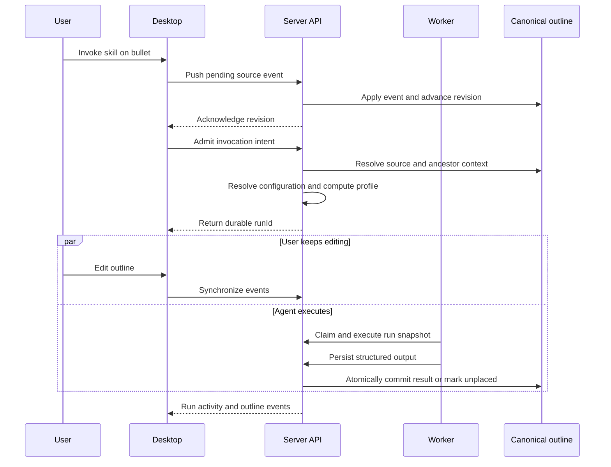
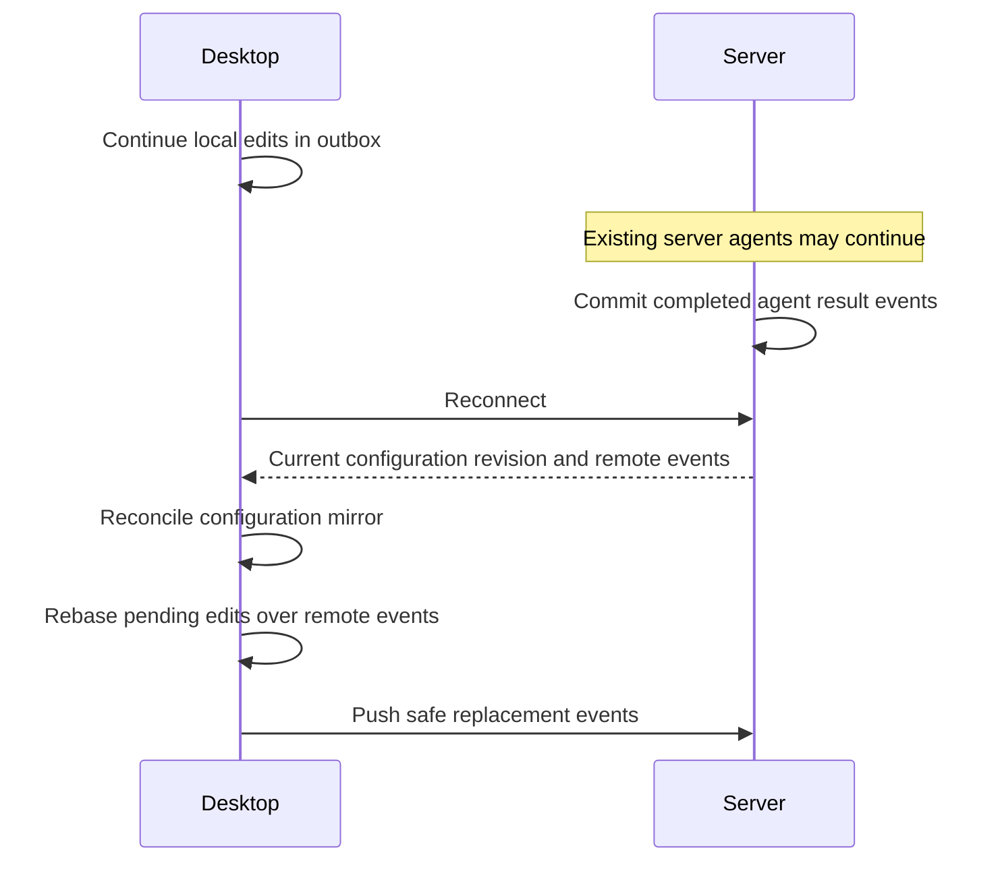

# Server-Mode Authority and Agent Execution

- **Date:** 2026-09-13
- **Status:** Approved design, not yet implemented
- **Implementation plan:** [Server-Mode Authority and Agent Execution Implementation Plan](../plans/2026-09-13-server-mode-authority-and-agent-execution.md)
- **Governing ADRs:** [ADR-0016](../../ADRs/ADR-0016-canonical-outline-over-note-index.md), [ADR-0017](../../ADRs/ADR-0017-provision-and-mirror-server-agent-configuration.md), [ADR-0018](../../ADRs/ADR-0018-environment-compute-profiles.md), [ADR-0019](../../ADRs/ADR-0019-intent-based-server-agent-admission.md), [ADR-0020](../../ADRs/ADR-0020-concurrent-agents-and-atomic-results.md)
- **Related:** ADR-0012, ADR-0015, `docs/architecture.md`, `docs/server-backend.md`, `openspec/changes/add-server-agent-executor`

## Problem

Forage currently coordinates server-mode agent execution across several pieces
of state:

1. the desktop editor and local SQLite outbox;
2. the immutable PostgreSQL outline event log;
3. the current JSON outline projection;
4. a flattened relational note projection;
5. versioned server agent configuration; and
6. environment-specific model credentials.

These stores do not have one explicit authority and readiness contract. The
desktop currently repairs some missing server state lazily while admitting an
agent run. That makes pressing Run responsible for document synchronization,
configuration publication, credential transfer, and execution admission.

The concrete failure that prompted this design demonstrated the problem. The
server held outline revision 128 and the canonical JSON document contained the
`/research` source bullet, but the derived `note_projections` table did not
contain that bullet. Run admission trusted the derived table, treated the
source as unavailable, and returned:

```text
authorization_denied: The requested resource is unavailable.
```

The published configuration and connected credential were valid. The error
was neither an authorization failure nor a configuration failure; it was an
internally inconsistent derived view.

## Decision summary

| Concern | Approved decision |
| --- | --- |
| Current outline authority | Use `outline_projections.state` at `outlines.current_revision` |
| Relational note rows | Treat `note_projections` as a disposable search cache |
| Correctness checks | Resolve and validate stable nodes from the canonical outline |
| Connected configuration | The server is authoritative while the desktop keeps a complete local mirror |
| Disconnected configuration | Activate and allow edits to the latest local mirror |
| Reconnect conflicts | Compare the recorded base; never silently overwrite two changed configurations |
| Agent model | Keep agents model-agnostic and resolve the selected model lazily |
| Compute and credentials | Bind them per execution environment, outside portable agent configuration |
| First connection | Provision outline and portable configuration explicitly and idempotently |
| Credential transfer | Require an explicit choice; never migrate credentials during Run |
| Readiness | Report independent outline, configuration, compute, worker, and cache states |
| Steady-state sync | Sync each state category according to its own lifecycle |
| Run request | Send invocation intent; let the server resolve the complete run snapshot |
| Duplicate safety | Key logical admission by a stable invocation ID, independent of configuration revision |
| Context | Snapshot canonical source and ancestors immutably at admission |
| Concurrency | Never lock editing; allow multiple agents to run at once |
| Desktop lifecycle | Let server runs survive popup closure, app closure, and disconnection |
| Observation | Manage all runs through a durable application-level run manager |
| Completed output | Persist output before placement and retain unplaceable output |
| Outline insertion | Commit a placed generated subtree as one atomic domain change |
| Errors | Reserve authorization errors for permissions and return typed state errors otherwise |
| Upgrades | Rebuild versioned disposable projections without truncating canonical data |

## Goals

- Establish one source of truth for every kind of server-mode state.
- Make stale derived data incapable of rejecting or corrupting a write.
- Provision portable configuration before it is needed instead of during Run.
- Keep a complete local configuration copy for deliberate disconnection and
  local execution.
- Resolve the selected model lazily from an environment compute profile rather
  than embedding it in each agent.
- Allow uninterrupted editing and multiple concurrent agent runs.
- Make run admission small, idempotent, durable, and server-resolved.
- Preserve completed model output even when its requested placement disappears.
- Replace ambiguous authorization errors with typed, actionable state errors.
- Upgrade persistent servers without truncating user data.

## Non-goals

- Multi-user permissions, shared outlines, or collaborative cursor presence.
- Automatic merging of two independently created outline histories.
- Field-level agent-configuration conflict merging in the first release.
- Per-agent model overrides in the first release.
- Making the note search index a transactional authority.
- Cancelling server work merely because a desktop closes or disconnects.

## Terminology

- **Canonical outline:** the current `OutlineState` stored in
  `outline_projections.state` at a specific server revision.
- **Durable history:** the immutable `outline_events` stream from which the
  canonical outline is derived.
- **Note index:** the flattened `note_projections` rows derived from the
  canonical outline for search performance.
- **Portable configuration:** agents, skills, custom tools, and tool policy.
  It contains no model choice or credential reference.
- **Compute profile:** an execution-environment setting that selects provider,
  model, and an environment-local credential binding.
- **Configuration mirror:** the desktop's local copy of the last confirmed
  server portable configuration, including its revision and hash.
- **Invocation intent:** the small request expressing which source and skill
  the user wants to run.
- **Run snapshot:** the immutable, fully resolved execution input persisted by
  the server at admission.

## 1. Outline authority

### Decision

The immutable event log is the durable history. At runtime,
`outline_projections.state` is the authoritative current server document. A
row is usable as the canonical outline only when its revision equals
`outlines.current_revision`.

`note_projections` is a disposable search cache. It is not a second outline
model and must never decide whether a correctness-critical operation is valid.

### Canonical validation

The following operations resolve stable nodes from the canonical outline:

- creating a child beneath a parent;
- moving a node;
- admitting a run from a source node;
- resolving the run's ancestor context;
- placing a completed agent result; and
- deciding whether a target is live, moved, deleted, or in Trash.

Search may read `note_projections`. Selecting a search result does not confer
validity: the subsequent operation validates the selected stable ID against
the canonical outline.

### Note-index lifecycle

The note index records both the canonical outline revision it represents and a
projector schema version. Rebuilding the full index from the canonical outline
is deterministic, idempotent, and safe.

Initially, the server rebuilds the flattened index once after each accepted
event batch. Incremental projection may be added later if measurement shows
that full rebuilding is too expensive.

Startup and data migrations compare the stored projector version with the
version expected by the running server. An outdated or missing index is
regenerated automatically without changing outline events or canonical user
content. If search is requested while the index is rebuilding, the server may
fall back to canonical traversal or return a typed temporary condition. No
write or agent admission may fail because the cache is behind.

## 2. Portable configuration authority and local fallback

### Decision

While connected, the server is authoritative for portable agent
configuration. The desktop retains a complete local mirror so that it remains
usable after deliberate disconnection.

Connected Settings changes use write-through semantics:

1. publish to the server with compare-and-swap;
2. receive the confirmed server revision;
3. store that exact revision and configuration locally; and
4. update the visible Settings state.

The desktop does not silently republish local configuration during a run.

### Configuration mirror

The local mirror stores:

- the portable configuration;
- the last confirmed server configuration revision; and
- a canonical hash of that confirmed configuration.

On deliberate disconnect, the mirrored configuration becomes the active local
configuration. Local edits made afterward are tracked as changes relative to
the last confirmed server revision and hash.

### Reconnection

On reconnect, the desktop compares the local configuration, its recorded base,
and the current server configuration:

| Local since base | Server since base | Result |
| --- | --- | --- |
| unchanged | unchanged | No action |
| unchanged | changed | Pull server configuration and refresh the mirror |
| changed | unchanged | Publish local configuration with compare-and-swap |
| changed | changed | Show a configuration conflict |

The first conflict UI resolves the whole portable configuration with **Use
local** or **Use server**. It never silently overwrites either version.
Field-level merging is deferred.

Outline event synchronization remains separate and continues to use its
existing event rebase behavior.

## 3. Model selection and credential binding

### Model-agnostic agents

Agent definitions do not contain a `modelId` or credential reference. They
define instructions and tool policy. Skills define workflow instructions,
their assigned agent, and capability requirements.

Each execution environment owns one active compute profile initially:

```text
ComputeProfile
  provider
  selectedModelId
  credentialBinding
```

The local executor uses the local compute profile. The server executor uses the
server compute profile. While connected, the Compute settings surface edits
the server profile; disconnecting restores the local profile for local runs.
Per-agent model overrides are intentionally omitted from the first version.

At admission, the active executor lazily resolves the selected model and
credential. The resolved model and sanitized credential metadata are recorded
in the immutable run snapshot for audit and reproducibility, but secrets are
never copied into the snapshot.

### Environment-specific credentials

Portable configuration describes provider and capability requirements, not
secret identity. Credential bindings belong to the execution environment:

```text
Agent/skill requirements -> active environment compute profile
Local compute profile    -> local credential
Server compute profile   -> encrypted server credential
```

Configuration import is automatic during provisioning. Credential transfer is
not. The first-connection UI explicitly offers to:

- copy the current credential to the server;
- connect a different credential directly on the server; or
- skip server compute while retaining outline synchronization.

Pressing Run never uploads, copies, or migrates a credential. Revoking a
credential prevents queued work from starting and stops further provider calls
where the executor can safely do so.

## 4. Connection provisioning and readiness

### First connection

First connection is an explicit, retryable provisioning workflow rather than a
set of repairs hidden inside agent execution:

1. validate and pin the server connection;
2. claim and seed a blank server, or adopt an existing server outline;
3. synchronize until the canonical outline is available;
4. import or reconcile the portable agent configuration;
5. persist the confirmed local configuration mirror; and
6. offer explicit server compute setup.

Outline and portable configuration provisioning are attempted before the
wizard considers those capabilities complete. A compute credential remains an
explicit trust decision.

Each step is idempotent. Retrying after interruption resumes from the first
incomplete step and never relies on Run to finish provisioning.

### Readiness is a vector

Readiness is not represented by one connection boolean. The server exposes and
the desktop displays independent capability state, including:

```text
connection
outlineSync
agentConfiguration
computeProfile
worker
noteIndex
```

Outline synchronization can be ready while compute needs authentication. That
state is a usable server connection: editing and synchronization continue, but
server agent execution is unavailable with a precise setup action.

Manual server admission requires:

- a ready canonical outline;
- ready portable agent configuration;
- a ready server compute profile;
- a compatible available worker; and
- sufficient device scope.

The note index is not an admission dependency.

## 5. Steady-state synchronization

After provisioning, each category follows its own lifecycle:

- outline content synchronizes continuously through immutable events;
- portable configuration synchronizes only when Settings changes or reconnect
  reconciliation requires it;
- the active server compute profile changes only through Compute settings;
- credentials change only through an explicit credential action; and
- run admission performs no configuration publication or credential migration.

Before a manual run, the desktop waits only until the relevant source edit has
been durably appended locally and acknowledged by the server. The user may
continue editing immediately after admission.

## 6. Intent-based run admission

### Desktop request

The desktop sends a small invocation intent rather than constructing a full
server `RunInput`:

```text
sourceNodeId
skillId
prompt
acknowledgedOutlineRevision
invocationId
```

For a manual slash command, the server derives the initial target from the
source node. Future placement choices may extend the intent without allowing
the client to supply configuration, model credentials, effective tools, or
context snapshots.

### Server resolution

Admission performs these steps on the server:

1. authenticate the device and verify the execution scope;
2. verify that the canonical outline has reached the acknowledged revision;
3. resolve the source and target from the canonical outline;
4. capture source and ancestor context from that outline;
5. load the latest portable agent and skill configuration;
6. lazily resolve the active server compute profile;
7. validate required tools and executor capabilities;
8. create the immutable run snapshot; and
9. durably admit the run.

Configuration changes affect only runs admitted afterward. Existing runs keep
their captured instructions, skill, tool permissions, selected model, and
context.

### Idempotency

Each user action creates one stable `invocationId`, used as the idempotency key
independently of configuration revision.

- Retrying the same network request returns the existing run.
- Reusing the ID with different intent data returns an idempotency conflict.
- An explicit **Run again** action creates a new invocation ID.
- A configuration change cannot cause the same invocation to execute twice.

The server stores a canonical intent hash beside the invocation identity.

## 7. Immutable context and concurrent work

Admission captures an immutable context snapshot containing:

- source node ID and text;
- ancestor node IDs and text;
- canonical outline revision;
- agent and skill definitions;
- effective tool permissions;
- resolved model; and
- sanitized compute-profile and credential metadata.

Edits after admission do not mutate what that run sees. Later invocations use
newer context.

Forage never locks outline editing while an agent runs. Multiple agents may run
at once, including beneath the same source. User edits and server agent results
enter the same globally ordered event stream. Results targeting the same live
parent are ordered by their accepted server revisions.

Server runs are independent of the slash popup, the originating React
component, and the desktop process. Closing or disconnecting the desktop does
not implicitly cancel work.

## 8. Durable run management

The desktop owns a global run manager rather than polling inside the slash
menu. It:

- records every admitted `runId`;
- lists queued, running, completed, unplaced, failed, and cancelled runs;
- resumes observing unfinished runs after reopening or reconnecting;
- supports individual cancellation and explicit retry; and
- navigates to placed results when available.

When disconnecting with active server runs, Forage does not block the user and
does not cancel the runs. It communicates that the runs continue remotely and
that their events and status will reconcile when that server is connected
again.

Offline or deliberately disconnected local editing remains available. Pending
local edits use the normal outbox. On reconnect, the desktop pulls remote agent
result events and rebases pending local edits over the authoritative event
stream using the same conflict rules as other concurrent edits.

## 9. Atomic result persistence and placement

### Persist before placement

Validated structured model output is durably stored with the run before the
server attempts to modify the outline. Placement failure therefore cannot lose
completed work.

### Placement behavior

The target is resolved by stable node ID against the latest canonical outline:

- If the target moved, insert beneath its current location.
- If its text changed, insert beneath it; the run snapshot retains the original
  source and context.
- If it was deleted or moved to Trash, do not resurrect it and do not discard
  the output. Mark the run `completed_unplaced`.
- A user may later choose a live destination for an unplaced result.

### Atomic outline change

A placed result enters the outline as one atomic domain change, conceptually:

```text
agent.result_committed
  runId
  targetNodeId
  generatedSubtree
  provenance
```

The event applies the complete generated subtree in one server transaction at
the latest outline revision. It forms one undo unit, preserves run provenance,
and never exposes a partially inserted result. Asset references remain subject
to the existing content-addressed validation rules.

Exactly one placement is permitted for a run result. Retried commits return the
existing result identity.

## 10. Error contract

`authorization_denied` is reserved for an authenticated principal that lacks
permission. Missing, stale, or inconsistent application state does not use a
403 authorization response.

The bound desktop protocol exposes typed conditions such as:

| Code | Typical status | Recovery |
| --- | --- | --- |
| `authentication_required` | 401 | Reauthenticate the device or compute profile |
| `authorization_denied` | 403 | Use a credential with the required scope |
| `outline_not_synced` | 409 | Synchronize through the required revision, then retry |
| `source_node_missing` | 409 | Choose a live source node |
| `source_node_changed` | 409 | Refresh the invocation and confirm the current source |
| `configuration_not_ready` | 409 | Complete configuration provisioning |
| `configuration_conflict` | 409 | Resolve local/server configuration divergence |
| `compute_profile_not_ready` | 409 | Select a model and connect a server credential |
| `capability_unavailable` | 422 | Change the skill/tool requirement or compute profile |
| `projection_rebuilding` | 503 | Retry search after rebuilding; never blocks a write |
| `worker_unavailable` | 503 | Start or repair the server worker |

Structured errors state whether retry is safe and identify the recovery action
the desktop should offer. Public endpoints may continue hiding cross-owner
resource existence. A correctly bound owner device receives precise state
diagnostics for its own outline.

## 11. Persistent upgrade and recovery policy

Database schema migrations and derived-data migrations are distinct:

- schema migrations create or alter durable tables and constraints;
- derived-data migrations regenerate disposable views from canonical data.

Every disposable projector has an explicit schema version and source revision.
After an application upgrade, startup detects an older projector, rebuilds it
from `outline_projections.state`, records the new version, and then marks that
capability ready.

User content, immutable outline events, run outputs, and credentials are not
truncated to repair a derived view. Operational reset instructions must never
be the normal upgrade path.

## 12. Primary flows

### Manual server run



### Disconnect and reconnect with remote work



## 13. Invariants

The implementation must preserve these invariants:

1. A stale note index cannot reject or authorize a write.
2. A run cannot be admitted from a source absent from the canonical outline.
3. Pressing Run cannot publish configuration or transfer a credential.
4. One invocation identity admits at most one logical run.
5. An admitted run's behavior does not change when Settings changes.
6. Completed structured output is not lost when placement fails.
7. One run result is placed at most once and appears as one outline change.
8. Editing is never locked by agent execution.
9. Closing or disconnecting a desktop does not implicitly cancel server work.
10. A persistent deployment can repair disposable projections without deleting
    canonical user data.

## 14. Acceptance scenarios

### Stale note index

Given a source exists in the canonical outline but is absent from
`note_projections`, manual admission succeeds, captures the canonical source,
and may trigger an index rebuild. Search-index inconsistency is observable but
does not affect the run.

### First connection

Given a desktop with a local outline and portable configuration connects to a
blank server, provisioning seeds the outline, publishes the configuration, and
stores the confirmed local mirror before normal server-mode execution. It asks
explicitly before any credential transfer.

### Reconnect conflict

Given local and server portable configuration both changed from the recorded
base, reconnect shows a whole-configuration conflict and changes neither side
until the user chooses one.

### Lazy compute resolution

Given the selected server model changes after run A is admitted, run A uses its
snapshotted model and run B uses the newly selected model. Neither agent
definition is rewritten.

### Lost admission response

Given admission succeeds but its response is lost, resending the same
invocation returns the existing run. It does not make a second provider call or
produce a second result.

### Concurrent editing and agents

Given several agents are running while the user moves and edits their source
branches, every run continues from its immutable context. Results are placed
beneath the current stable target when it remains live.

### Deleted target

Given an agent completes after its target moves to Trash, the structured output
is retained and the run becomes `completed_unplaced`. No outline node is
resurrected, and the user can later place the result exactly once.

### Disconnect with active runs

Given the desktop disconnects while server runs continue, local editing remains
available. Reconnecting pulls remote results and rebases pending local edits;
disconnect does not cancel work.

### Upgrade from inconsistent data

Given a server starts with an older or incomplete note index, startup rebuilds
the index from the canonical outline and preserves all events, content, run
history, and credentials.

## 15. Superseded behavior

When implemented, this design replaces the following current behavior:

- correctness-critical lookup through `note_projections`;
- model IDs and credential references embedded in agent definitions;
- lazy agent-configuration publication during Run;
- lazy desktop credential migration during Run;
- desktop construction of a complete server `RunInput`;
- slash-menu-owned polling of server runs;
- multi-event partial result materialization; and
- `authorization_denied` for missing canonical application state.

Until implementation is complete, `docs/architecture.md` and
`docs/server-backend.md` continue to describe the currently shipped behavior.
